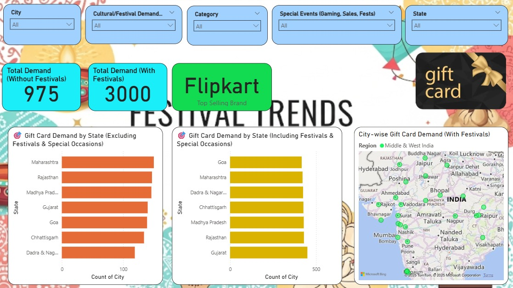
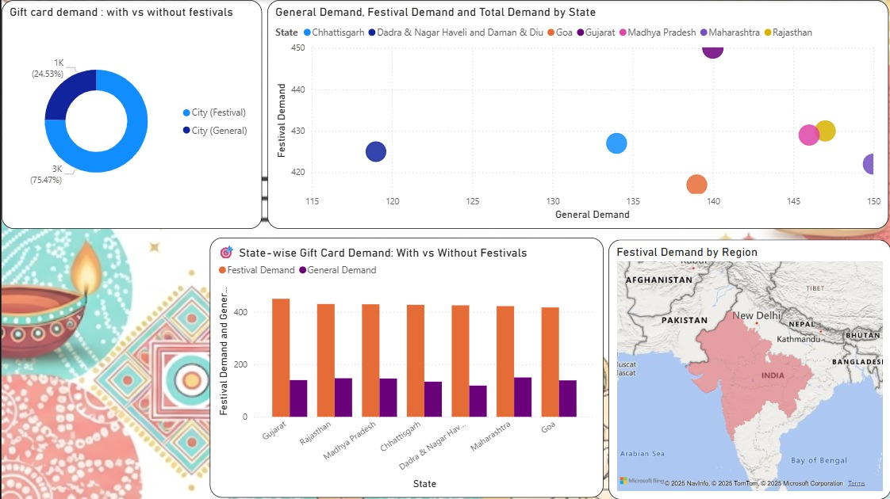

# 🎁 Gift Card Trends Dashboard — West & Central India  

An **interactive Power BI dashboard** analyzing gift card usage across Indian geographies, with a focus on **West & Central India**.  
The dashboard highlights regional trends, category composition, best-selling brands, and event-based usage — helping uncover how gifting behavior changes across seasons, cities, and festivals.  

---

## 📊 Key Insights
- 🌍 **Regional & City-wise demand**: Identified high-demand states & cities.  
- 🏷️ **20+ Categories tracked**: Food, Fashion, Gaming, Entertainment, etc.  
- ⭐ **Top-selling brands**: Amazon, Big Bazaar, Flipkart, and more.  
- 📈 **Quarterly & Monthly patterns**: Useful for demand forecasting.  
- 🎉 **Festival & Event-driven spikes**: Insights from Diwali, E-commerce sales & Gaming fests.  

---

## 🔗 How to Use
1. Download the `.pbix` file from this repo.  
2. Open it in [Power BI Desktop](https://powerbi.microsoft.com/desktop/).  
3. Explore the interactive visuals using filters and slicers.  

---

## 📸 Preview

  
  

---

## 🙌 Credits
Project by **Kusan Chakraborty**  
- Hashtags for LinkedIn:  
  `#Gameonix #DataAnalytics #PowerBI #Dashboard #GiftCardTrends`  

